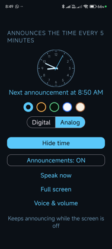
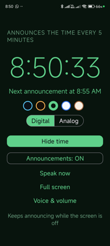
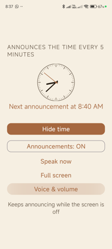
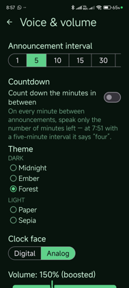
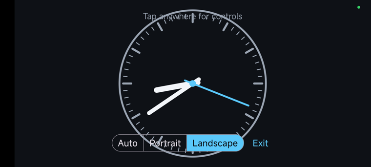

# Time Speaker

An Android app that announces the time out loud on every interval mark of the clock
("It's seven oh five A M"), and shows a live clock — digital or analog — in one of
five themes.

Announcements keep running while the phone is locked and the screen is off.

## Download

**[Download the latest APK](https://github.com/sant527/talking-clock-android/releases/latest/download/time-speaker-v1.0-debug.apk)**

All versions are on the [Releases page](https://github.com/sant527/talking-clock-android/releases).
The APK is attached to each release rather than committed to the repository, so the
history does not carry a 5 MB binary per version.

This is a **debug-signed** build, so Android will warn about installing from an
unknown source. On the phone: open the file, allow "install unknown apps" for your
browser or file manager, then install. Requires **Android 8.0 (API 26)** or newer.

To build it yourself, the output lands at
`app/build/outputs/apk/debug/app-debug.apk`.

## Screenshots

| Midnight · analog | Forest · digital | Sepia · analog |
| --- | --- | --- |
|  |  |  |

The row of swatches under the clock switches theme, and the toggle beside it swaps
between the digital and analog faces — without leaving the screen.

| Settings | Full screen |
| --- | --- |
|  |  |

Full screen hides the system bars and fills the display, in portrait or landscape:



## Features

- Speaks the time on every interval mark — **1, 5, 10, 15, 30 or 60 minutes**
- **Countdown**: optionally speaks the minutes remaining on each minute in between
  ("four", "three", "two", "one"), with its own voice/volume or shared with the
  announcements
- Keeps announcing while the screen is off, via a foreground service and exact alarms
- **Digital or analog** clock face, with hour numerals and a sweeping second hand
- **Five themes** — Midnight, Ember, Forest (dark); Paper, Sepia (light)
- **Full-screen clock** with portrait / landscape / auto orientation
- **Volume 0–400%**, amplified past the device's media volume above 100%
- **Pitch and speed** control, and a picker for the device's installed voices
- No network access, no analytics, no data collection

## Versions used

Everything below is what this project was built and tested with.

### Build toolchain

| Component | Version |
| --- | --- |
| Gradle | 8.7 (`gradle-8.7-bin`, via the wrapper) |
| Android Gradle Plugin (AGP) | 8.5.2 |
| Kotlin | 1.9.24 (`org.jetbrains.kotlin.android`) |
| JDK | 21.0.11 (JetBrains Runtime, `JBR-21.0.11+10-1163.116`) |
| Java source/target compatibility | 17 |
| Kotlin `jvmTarget` | 17 |

### Android SDK

| Setting | Value |
| --- | --- |
| `compileSdk` | 34 (Android 14) |
| `targetSdk` | 34 (Android 14) |
| `minSdk` | 26 (Android 8.0 Oreo) |
| Build Tools | 34.0.0 |
| `versionCode` / `versionName` | 1 / 1.0 |
| `applicationId` | `com.example.timespeaker` |

### Dependencies

| Library | Version | Licence |
| --- | --- | --- |
| `androidx.core:core-ktx` | 1.13.1 | Apache 2.0 |
| `androidx.appcompat:appcompat` | 1.7.0 | Apache 2.0 |
| `com.google.android.material:material` | 1.12.0 | Apache 2.0 |

No Google Play Services, no Firebase, no analytics SDKs.

### Development environment

| | |
| --- | --- |
| Android Studio | 2026.1 (build `AI-261.26222.65.2613.16025427`) |
| macOS | 26.6.2 (build 25G83) |
| Git | 2.50.1 |

### Tested on

| | |
| --- | --- |
| Device | Xiaomi Redmi Note 11 (`2201117SI`, codename `miel`) |
| Android | 13 (MIUI) |
| Text-to-speech engine | Google TTS, `en-IN` voices |

## Permissions and why

| Permission | Why |
| --- | --- |
| `FOREGROUND_SERVICE`, `FOREGROUND_SERVICE_SPECIAL_USE` | Keeps announcing with the screen off |
| `POST_NOTIFICATIONS` | The ongoing notification the foreground service requires (Android 13+) |
| `WAKE_LOCK` | Held only for the ~2 seconds of each utterance |
| `USE_EXACT_ALARM` / `SCHEDULE_EXACT_ALARM` | Announcements must land on the minute |
| `MODIFY_AUDIO_SETTINGS` | Attaching the loudness amplifier used by the volume boost |

There is deliberately **no `INTERNET` permission**.

## Building

```sh
./gradlew assembleDebug     # APK -> app/build/outputs/apk/debug/app-debug.apk
./gradlew installDebug      # build and install on a connected device
```

You need a `local.properties` pointing at your Android SDK (Android Studio writes
this for you):

```properties
sdk.dir=/Users/<you>/Library/Android/sdk
```

## Setup on Xiaomi / Redmi / POCO (MIUI)

MIUI kills background services aggressively. Two one-time toggles are needed or the
announcements stop after a while:

1. **Settings → Apps → Manage apps → Time Speaker → Autostart** → on
2. Same screen → **Battery saver** → **No restrictions**

Other manufacturers (OnePlus, Oppo, Vivo, Samsung) have an equivalent
"don't optimise this app" setting under battery.

## How it works

**Scheduling.** The service does not hold a permanent wake lock — that would keep the
CPU awake around the clock. It schedules one exact alarm
(`setExactAndAllowWhileIdle`, which survives Doze) for the next mark, wakes for the
two seconds it takes to speak, and schedules the next one.

**Speech.** Numbers are spelled out ("seven oh five", "four") rather than passed as
digits, because engines read digits inconsistently.

**Volume above 100%.** The speech engine cannot play louder than the device's media
volume, so the extra comes from a `LoudnessEnhancer` attached to the announcement's
own audio session — music and other apps are unaffected. 400% is +40 dB.

**Voice gender.** Android exposes no gender on `Voice`, so voices are listed by accent
and you tag them M/F yourself after hearing them. The tags are labels only.

## Source layout

| File | Purpose |
| --- | --- |
| `TimeAnnouncerService.kt` | Alarms, wake locks, TTS, notification |
| `MainActivity.kt` | Clock display and controls |
| `FullscreenClockActivity.kt` | Full-screen clock and orientation |
| `SettingsActivity.kt` | Interval, countdown, theme, clock face, voice and volume |
| `AnalogClockView.kt` | The dial face |
| `SpeechOutput.kt` | The one audio path — volume, boost, session |
| `VoiceSettings.kt` | Voice listing and application |
| `TimeSpeech.kt` | Turns a time or number into a spoken phrase |
| `Prefs.kt` | Stored settings |
| `Appearance.kt` | Theme, clock-face, orientation and speech-profile types |
| `QuickControls.kt` | Theme swatches shown on the main and full-screen clocks |

All sources are under `app/src/main/java/com/example/timespeaker/`.
